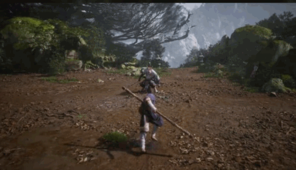

《黑神话：悟空》是游戏科学在 8 月 20 号发行的一款 ARPG(Action Roling Play Game)游戏，开发成本4亿，制作周期6年，算的上是真正意义上的首款国产 3A 游戏。根据 [Video Game Insights](https://vginsights.com/game/2358720) 数据截止到目前共售出近 1700万份，95.9% 为好评. Steam 上的总体评价也是好评如潮

# 世界观

故事发生在西天取景之后，孙悟空被封为斗战神佛，但是一段时间后他并不适应当佛的日子。所以辞去佛位，回到了花果山。天庭与西天立时发难，重派二郎神率天兵天将欲捉回孙悟空，剿灭花果山。与二郎神一同而来的，还有昔日的战友与劲敌。花果山上方，昔日神妖之战再度上演。孙悟空眼见众猴遭天兵屠戮，怒上眉山一人独战二郎神与四大天王。激战正酣之时，他头顶突然浮现早已消失的紧箍咒，头痛欲裂之际遭杨戬重创，随后遭到劲敌围攻，最终死于牛魔王怀中。临死之前，孙悟空的力量化作六个神器（六根），其中五个被天庭分于在场的五名臣服于诸天的妖魔。
>黑熊得眼看喜。黄风得耳听怒。黄眉得鼻嗅爱。百眼得舌尝思。牛魔得身本忧。

而六根中的第六根 意在欲代表了孙悟空的意志，消散在花果山。孙悟空的记忆和残躯化作一个石胎，而它的袍袖战甲全都化消成了花果山强大的生灵。而后天庭意欲培养出完全于听命于自己的孙悟空，完全掌握孙悟空的力量，天命人计划就此展开。所以天命人其实是天庭从花果山猴群中挑选出来，让他效仿西行之路，挑战持有孙悟空根器的群雄，进而继承孙悟空的力量，最后回到花果山，乖乖带上金箍。

所以游戏一共分为六回
第六回未竟还没有打通关，所以并不知道之后的剧情
```
火照黑云，败黑熊，得眼看喜
风起黄昏，败黄风，得耳听怒
夜生白露，败黄眉，得鼻嗅爱
曲度紫鸳，败百眼，得舌尝思
日落红尘，败红孩，得身本忧
未竟，败大圣残躯
```

# 能量系统
- 生命值 - 通过喝葫芦中的酒来恢复
- 法力值 - 某些丹药有恢复效果
- 气力值 - 不再消耗时自动恢复
- 棍势 - 通过普通攻击，闪避以及主动蓄力来积攒
    - 棍势槽
    - 棍势豆
- 元气 - 攻击对手可以获得元气，化身技和法宝的消耗品

# 战斗系统
## 本事（物理攻击）

### 轻攻击
轻攻击一共有 5 段，最后一段产生大量伤害以及积攒大量棍势


### 重攻击
消耗所有棍势，打出大量伤害，按照棍法不同可以分为劈棍，立棍和截棍

#### 劈棍


#### 立棍


#### 截棍


### 闪身


### 切手技
组合技，轻攻击的过程中接续重攻击, 切手技的效果和当前所选择的棍法以及当前的加点情况有关，图示为立棍的切手技。


### 识破
在敌人发起进攻到击中之前使用切手技，则回触发识破，可以抵消伤害

## 神通（法术）
施放神通需要消耗法力值

### 奇术
如：定身法，将对手锁定在原地


### 身法
如：聚形散气，化作白烟，隐身遁走，破隐一击造成额外伤害


### 毫毛
如：身外身法，吹散毫毛，变出多只毛猴，协助战斗


### 变化
如：赤潮，变成狼妖，拥有变化对象的武器和技能


## 化身技
施放化身技需要消耗元气

在击败某些精英版敌人，并将其精魄吸进葫芦中之后，即可获得对应敌人的化身技。化身技相当于只能使用一次攻击的临时变身。例如：幽魂




## 法宝
法宝通过触发隐藏剧情来获得，施放法宝需要消耗元气


# 角色成长

## 灵光点
击败敌人会获取道行（经验值），每升一级会获得一个灵光点，随着等级的提升，灵光点获得的越多，天命人的技能和数值也会水涨船高，打起来也就更加得心应手。

## 葫芦和酒
三部分组成: 葫芦，酒，泡酒物, 饮酒的回复效果主要取决于其中泡制的酒，可以恢复生命值，以及一些增益效果，例如（伤害减免，增加暴击等）。 同样的，泡酒物的不同也会影响增益效果

## 武器披挂
主要包括，武器，头冠，衣甲，臂甲，腿甲。不同装备提供不同的防御和耐性，成套的装备，可以提供额外的增益。游戏第六回在花果山可以获得大圣套装, 藕丝步云屡，锁子黄金甲，凤翅紫金冠，**点翠飞龙釬(han)** 和如意金箍棒

## 丹药
游戏中还有独具中国神话特色的丹药系统，通过在游戏中收集不同的原料，可在炼丹炉炼制各种丹药，这些丹药可以用来解除战斗中的异常状态，或者增强某种属性和技能，更能在战斗中解救天命人于危难之中，是游戏中的重要辅助之一。

# 美术场景
黑神话悟空的美术设计真是出色，场景极其丰富，每一处细节都充满了创意和用心。放一些图自己体会。

## 沙漠


## 雪地


## 山林


# 个人评价
黑神话悟空绝对算的上顶尖的3A游戏大作
- 优点
    - 出色的动作系统设计以及精彩的战斗体验
    - 精彩的故事主线与丰富的支线内容
    - 出色的场景美术效果
    - 独具中国特色的以及恰到好处的音乐
- 缺点
    - 地图的缺失很容易迷路
    - 少量 bug, 闪退以及卡死问题


# Appendix

- [游戏音乐合集](https://y.qq.com/n/ryqq/albumDetail/004B5xJQ0GOPPI)
- [新华社采访主创冯骥](https://www.bilibili.com/video/BV1Gi421a74W/)
- [黑神话悟空电影剪辑版](https://www.bilibili.com/video/BV1RuWpezE7h/)
- [黑神话悟空的游戏音乐风格和设计 by 8082 audio](https://www.bilibili.com/video/BV1NP4y1E7sV/)
- [Video Game Insights: Black Myth](https://vginsights.com/game/2358720)
- [黑神话悟空游戏wiki](https://wiki.biligame.com/wukong/%E9%A6%96%E9%A1%B5)