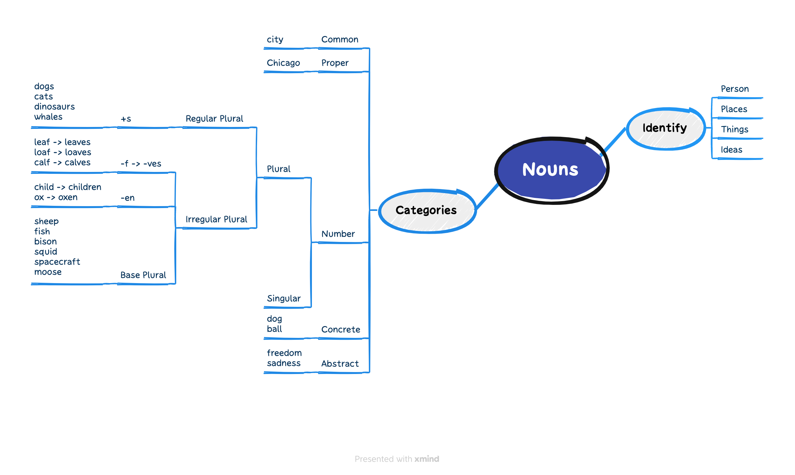

## 前言

入职一家外企一年多了，但是自己的英语能力并没有什么特别大的提升，总结起来我觉得有两点主要的原因：

1. 没有进行系统的学习，知识点比较分散难以很好的关联，所以学了忘
2. 没有坚持下来，三天打渔，两天晒网

再加上，最近开会非常频繁，让我觉得学习英语迫在眉睫了。所以，我有了一个新的英语学习计划：

1. 系统的学习，我准备分成三个大的部分，大概每天需要花费2-3个小时:
   - 语法：可汗学院的 [Grammar](https://www.khanacademy.org/humanities/grammar/) 课程
   - 词汇：[100个句子记完7000个雅思单词](https://book.douban.com/subject/34999853/)
   - 听力：[Npr Life Kit](https://www.npr.org/podcasts/510338/all-guides), 希望可以一周完成一篇文章的精听。
2. 将每天的知识点记录在这里，以便更好的复习

## 词汇

There is *considerable* *debate* over how we should react if we detect a signal from an alien civilisation.

| | |
|:---:|:---:|
|venture |英:/ˈventʃə(r)/ 美:/ˈventʃər/|
|seek |英:/siːk/ 美:/siːk/|
|sick |英:/sɪk/ 美:/sɪk/|
|risk |英:/rɪsk/ 美:/rɪsk/|
|grope |英:/ɡrəʊp/ 美:/ɡroʊp/|
|ferret |英:/'ferɪt/ 美:/'fɛrɪt/|
|explore |英:/ɪkˈsplɔː(r)/ 美:/ɪkˈsplɔːr/|
|ultraviolet |英:/ʌltrə'vaɪələt/ 美:/ˌʌltrə'vaɪələt/|
|spacecraft |英:/ˈspeɪskrɑːft/ 美:/ˈspeɪskræft/|
|solar |英:/ˈsəʊlə(r)/ 美:/ˈsoʊlər/|
|primitive |英:/ˈprɪmətɪv/ 美:/ˈprɪmətɪv/|
|planetary |英:/ˈplænətri/ 美:/ˈplænəteri/|
|organic |英:/ɔːˈɡænɪk/ 美:/ɔːrˈɡænɪk/|
|orbiter |英:/'ɔːbɪtə/ 美:/'ɔrbɪtɚ/|
|microbial |/maɪ'krobɪəl/|
|lander |英:/'lændə/ 美:/'lændɚ/|
|inorganic |英:/ɪnɔː'gænɪk/ 美:/'ɪnɔr'gænɪk/|
|inhospitable |英:/ˌɪnhɒ'spɪtəb(ə)l/ 美:/ˌɪnhɑ'spɪtəbl/|
|humidity |英:/hjuːˈmɪdəti/ 美:/hjuːˈmɪdəti/|
|habitable |英:/ˈhæbɪtəbl/ 美:/ˈhæbɪtəbl/|
|extract |英:/ˈekstrækt/ 美:/ˈekstrækt/|
|evolution |英:/ˌiːvəˈluːʃn/ 美:/evəˈluːʃn/|
|dweller |英:/ˈdwelə(r)/ 美:/ˈdwelər/|
|wrangle |英:/'ræŋg(ə)l/ 美:/'ræŋɡl/|
|tiff |英:/tɪf/ 美:/tɪf/|
|squabble |英:/ˈskwɒbl/ 美:/ˈskwɑːbl/|
|rejoinder |英:/rɪˈdʒɔɪndə(r)/ 美:/rɪˈdʒɔɪndər/|
|refute |英:/rɪˈfjuːt/ 美:/rɪˈfjuːt/|
|rebut |英:/rɪ'bʌt/ 美:/rɪˈbʌt/|
|quarrel |英:/ˈkwɒrəl/ 美:/ˈkwɑːrəl/|
|gainsay |英:/ˌɡeɪnˈseɪ/ 美:/ˌɡeɪnˈseɪ/|
|eloquent |英:/ˈeləkwənt/ 美:/ˈeləkwənt/|
|eloquence |英:/ˈeləkwəns/ 美:/ˈeləkwəns/|
|dissentious| /dɪ'senʃəs/|
|dispute |英:/dɪˈspjuːt/ 美:/dɪˈspjuːt/|
|disprove |英:/ˌdɪsˈpruːv/ 美:/ˌdɪsˈpruːv/|
|deny |英:/dɪˈnaɪ/ 美:/dɪˈnaɪ/|
|debatable |英:/dɪˈbeɪtəbl/ 美:/dɪˈbeɪtəbl/|
|counter |英:/ˈkaʊntə(r)/ 美:/ˈkaʊntər/|
|controvert |英:/ˌkɒntrəˈvɜːt/ 美:/ˈkɑːntrəvɜːrt/|
|controversy |英:/ˈkɒntrəvɜːsi/ 美:/ˈkɑːntrəvɜːrsi/|
|contention |英:/kənˈtenʃn/ 美:/kənˈtenʃn/|
|brawl |英:/brɔːl/ 美:/brɔl/|
|bicker |英:/ˈbɪkə(r)/ 美:/ˈbɪkər/|
|civilisation | /ˌsivilai'zeiʃən/|
|alien |英:/ˈeɪliən/ 美:/ˈeɪliən/|
|signal |英:/ˈsɪɡnəl/ 美:/ˈsɪɡnəl/|
|detect |英:/dɪˈtekt/ 美:/dɪˈtekt/|
|react |英:/riˈækt/ 美:/riˈækt/|
|considerable |英:/kənˈsɪdərəbl/ 美:/kənˈsɪdərəbl/|

## 语法

## 听力

SEGARRA: Hey, everybody. It's Marielle Segarra. Not too long ago, a report came out about gas stoves. When you cook with them, they emit pollutants like nitrogen dioxide. And the report estimated that about 13% of current childhood ***asthma*** cases in the U.S. are attributable to gas stove use. Suddenly, it seemed like everybody was talking about gas stoves and how you really need to be ***ventilating*** if you have one. And I honestly didn't know that - never thought about it, don't have a fan over my stove, and I wasn't opening the window consistently when I cooked. I remember thinking, oh, my God, I've been poisoning myself this whole time. Fact check - no. However, I have probably been exposing myself to gases that might ***exacerbate*** ***respiratory*** illness over time.

When we talk about health risks from the environment, things get confusing and ***overwhelming*** fast. It's hard to know just how big of a deal these risks are and also what changes you need to make and when you're going overboard. But that's what we do here at LIFE KIT. We help you figure this stuff out. So in this episode, we're going to talk about indoor air quality. With the help of researchers, we will give you five practical ways to improve your air quality at home, including tips on how to clean your house, how to choose an air filter and how to test your air. A quick note here - one thing we're not going to talk about in this episode is preventing the spread of diseases or ***airborne*** viruses like COVID. But NPR has done a ton of reporting on that, so check it out.

SEGARRA: All right. If you want to improve the indoor air quality in your house, one of the first things to think about is the pollution that's coming from inside. Andrea Ferro is an environmental engineering professor at Clarkson University, and she focuses on indoor air quality. She says because of the things we do in our houses - cooking, cleaning, home improvement projects...

ANDREA FERRO: We have lots of pollutant sources indoors. ***And if you think about it, the volume of air that the pollutants can mix in is much smaller indoors than outdoors***.

SEGARRA: So if you walk away from this episode with one piece of advice, I hope it's this - ***ventilate***. That's right. It may seem obvious, but we've got to say it. You want fresh air? Open the windows. We love a cross-breeze. And if you have one, maybe in your bathroom or over your stove, turn on a fan that vents outside. Make a habit of this, especially when you're doing something that releases pollutants into the air. A very common indoor air polluting activity? Cooking. Look, cooking at home is a great choice. It's often cheaper and healthier, but it can release pollutants and ***particles*** into the air. This is especially true if you use a gas stove because that means you're burning fossil fuel in your house. Jeff Brady is a correspondent on NPR's Climate Desk, and he's been covering this topic. He says, according to health experts, the biggest indoor air quality concern with gas stoves is nitrogen dioxide.

JEFF BRADY, BYLINE: And there is some research that shows in homes with gas stoves, kids have about a 20% increased risk of developing respiratory illness. And recently, there was a peer-reviewed study that found that more than 12% of current childhood asthma in the U.S. is attributable to gas stove use.

SEGARRA: So the risk is highest for kids and for people with lung diseases. If you're a healthy adult...

BRADY: A lot of the researchers and ***epidemiologists*** I've talked to over the last year and a half I've been covering this story - they say you probably don't have a lot to worry about, especially if you have one of these ***hoods(抽油烟机)*** over your ***range(灶具)*** that ***vents*** all of those pollutants outdoors.

SEGARRA: If you don't have one of those, opening a window could help. The experts we talked to said you also want to ventilate when you burn things like ***incense*** or when you ***spray*** cleaning products or use personal care products that create ***fumes*** like nail polish remover, 'cause all of those things can pollute the air. We do have a ***caveat*** here. Before you open a window, check the outdoor air quality in the place you live 'cause there are lots of pollutants outside, too - ***ozone***, ***fine particulates***, smoke from wildfires, biological pollutants like ***pollen***. And while it's important to ventilate in general, you may realize that right now, you need to close your windows.

<iframe src="https://www.npr.org/player/embed/1174308607/1174877532" width="100%" height="290" frameborder="0" scrolling="no" title="NPR embedded audio player"></iframe>
