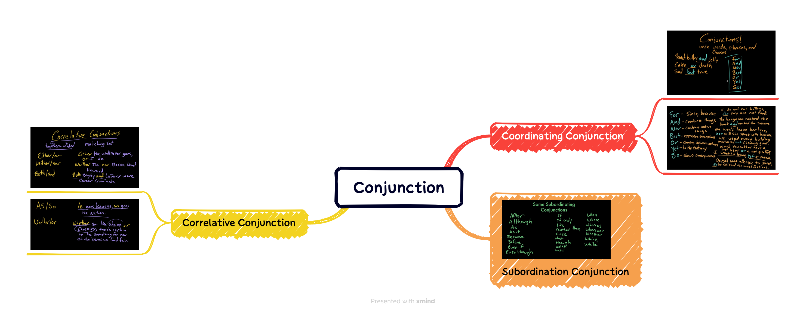

## 语法

## 词汇

|||
|:---:|:---:|
|intrusive| 英:/ɪn'truːsɪv/ 美:/ɪn'trusɪv/|
|push our buttons| |
|nagging| 英:/ˈnæ gɪŋ/ 美:/'næɡɪŋ/|
|sidle| 英:/'saɪd(ə)l/ 美:/'saɪdl/|
|dementia| 英:/dɪ'menʃə/ 美:/dɪ'mɛnʃə/|
|diapers| /'daɪəpɚ/|
|cowardly| 英:/'kaʊədlɪ/ 美:/ˈkaʊədli/|
|framed| /freimd/|
|avoidance| 英:/əˈvɔɪdəns/ 美:/əˈvɔɪdəns/|
|journalist| 英:/ˈdʒɜːnəlɪst/ 美:/ˈdʒɜːrnəlɪst/|
|touchy| 英:/ˈtʌtʃi/ 美:/ˈtʌtʃi/|
|divorce| 英:/dɪˈvɔːs/ 美:/dɪˈvɔːrs/|
|tense| 英:/tens/ 美:/tens/|
|couch| 英:/kaʊtʃ/ 美:/kaʊtʃ/|
|therapist| 英:/ˈθerəpɪst/ 美:/ˈθerəpɪst/|
|intention| 英:/ɪnˈtenʃn/ 美:/ɪnˈtenʃn/|
|brawl| 英:/brɔːl/ 美:/brɔl/|
|verbal| 英:/ˈvɜːbl/ 美:/ˈvɜːrbl/|
|guilt| 英:/ɡɪlt/ 美:/ɡɪlt/|
|obligation| 英:/ˌɒblɪˈɡeɪʃn/ 美:/ˌɑːblɪˈɡeɪʃn/|
|spoiling| |
|productively| /prə'dʌktivli/|
|deflect| 英:/dɪˈflekt/ 美:/dɪˈflekt/|
|mediate| 英:/ˈmiːdieɪt/ 美:/ˈmiːdieɪt/|
|engage| 英:/ɪnˈɡeɪdʒ/ 美:/ɪnˈɡeɪdʒ/|
|improv| 英:/'imprəuv/ 美:/ˈɪmˌprɑv/|
|gathering| 英:/ˈɡæðərɪŋ/ 美:/ˈɡæðərɪŋ/|
|arises| /ə'raiz/|
|combat| 英:/ˈkɒmbæt/ 美:/ˈkɑːmbæt/|
|needle| 英:/ˈniːdl/ 美:/ˈniːdl/|
|brewing| 英:/'bruːɪŋ/ 美:/'brʊɪŋ/|
|storm| 英:/stɔːm/ 美:/stɔrm/|
|cape| 英:/keɪp/ 美:/keɪp/|

## 听力

Hey, everybody. It's Marielle. OK, so picture this - it's the holidays. You're having dinner with the family, and you can feel a ***storm brewing***. Your brother-in-law starts to ***needle*** you about what you're eating or not eating. Two of your cousins have started just lightly shouting at each other, or your aunt is asking your sister yet again when she's having kids. You know, families fight, especially when they're all together under the same roof and especially if people are drinking, even though ***combat*** is probably not the reason you showed up. What if we approach this differently? On this episode of LIFE KIT, we're going to share some tools you can use when conflict ***arises*** during a family ***gathering***.

NEDRA GLOVER TAWWAB: It's ***improv***, right? You're saying what works in the moment. You have these tools. You have these strategies. You have these scripts of what to say. Some things will land and other things won't.

SEGARRA: We'll talk about when to ***engage*** or ***mediate***, when to delay a conversation or ***deflect*** and how to disagree ***productively*** so you can actually enjoy the time you have together.

(SOUNDBITE OF MUSIC)

SEGARRA: All right. So like I was saying, most of us don't go to family gatherings ***spoiling*** for a fight. We may go out of ***obligation*** or ***guilt***, but we're still hoping to connect or to feel joy that day. If you know that your family's holiday events tend to turn into ***verbal*** ***brawls***, you can prepare for that by getting clear on your ***intentions*** going in. Remember; the only person you can control is you.

AMY LEW: I think it always has to start with ourselves.

SEGARRA: Amy Lew is a ***licensed marriage*** and family ***therapist*** based in San Diego, and she says you'll want to figure out why you want to attend this gathering.

LEW: So what is it that I want to experience today, and how do I want to offer myself to my family?

SEGARRA: In terms of what you want to experience...

LEW: That can be answered in a multitude of ways. Maybe the most important thing is I spend time with my one cousin who's going through a ***terminal illness*** and the other people don't really matter to me in this particular event. Or maybe it's I really want to connect with my elder over cooking certain things. I maybe really want to be lazy and watch TV on the ***couch*** and kind of not engage and not lead today, all of it cool.

SEGARRA: Whatever your why is, that will be your anchor and something for you to come back to if dinner gets ***tense***. OK, so that said, when conflict starts to bubble up, maybe grandma is reminding your mom of her ***divorce*** and that is still a ***touchy*** subject, you have the option to not engage. Takeaway one - you're allowed to avoid conflict. Celeste Headlee is a ***journalist*** and the author of several books, including "We Need To Talk: How To Have Conversations That Matter," and she says here's a good place to start in these moments.

CELESTE HEADLEE: Remind yourself that this is temporary. Whatever's happening right now is very short term, and you're going to go home and you're going to be able to do whatever it is that you love most in the world and relax, and it will not last forever.

SEGARRA: Conflict ***avoidance*** is often ***framed*** as ***cowardly***, like you're hiding from an important conversation or a moment of growth. But if you don't have the time and energy or you just don't want to engage with someone about this topic over Christmas dinner, that is fine.

HEADLEE: That's one of the things that you can do - is just let it blow over you. You know, they say the only argument with an east wind is to put on your overcoat, right? Then put on your overcoat and enjoy your meal and then go home.

SEGARRA: One way to stay out of the fray during family holiday events is to keep yourself busy. Maybe you love kids, and so you're going to help change some ***diapers***. You know, give your brother and his husband a break. Or maybe you're going to do the kitchen cleanup or sit with your great aunt who has ***dementia***. Those are helpful things to do, and they're also absorbing activities, too. Also, if you know there's a family member who always tries to fight with you or to criticize your life choices, it is OK to avoid them. You know, say hello and goodbye, but don't sit right next to them at dinner.

HEADLEE: You know, there are certain people in our families who know us really well who know how to ***push our buttons***. And if you know going in who are the people who generally do that over and over, stay away from them.

SEGARRA: If Uncle Mark does ***sidle*** up to you and start ***nagging*** you about your dating life, Amy has some exit lines for you.

LEW: I'm going to go get a snack. Anyone want anything? Cool. Bye. I've got to go to the bathroom. I'm kind of thirsty. Oh, look. So-and-so's here, right? We have a lot of exits in that way. I think children are excellent little exits. Oh, look at so-and-so. Look at her outfit. Peace out.

SEGARRA: Now, maybe you don't want to completely piece out or avoid a person or one of these uncomfortable conversations. Takeaway two - try keeping your responses to a minimum. Deflect, set a boundary, or redirect. These kinds of responses are a small way to engage but keep it moving. Say you have a family member who's peppering you with ***intrusive*** questions that you don't want to answer and you want to get that point across, Nedra Glover Tawwab is a licensed therapist and author, and she says one option is to just say that directly.

GLOVER TAWWAB: I don't want to talk about it. I don't want to talk about dating. I don't want to talk about having kids. My thoughts about it aren't even fully processed, you know? So I'm still in the thinking phase, you know, even saying that, I'm still in the thinking phase about it.

<iframe src="https://www.npr.org/player/embed/1196978388/1219103386" width="100%" height="290" frameborder="0" scrolling="no" title="NPR embedded audio player"></iframe>