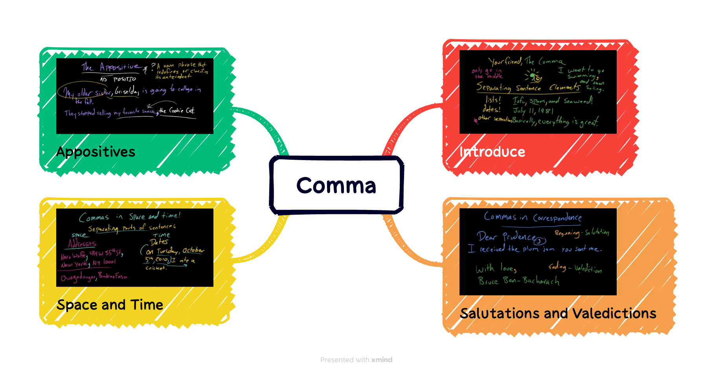

## 语法

## 词汇

|||
|:---:|:---:|
|fisticuff| /'fɪstɪ,kʌf/|
|spitting| 英:/'sptiŋ/ 美:/ˈspɪtɪŋ/|
|roll| 英:/rəʊl/ 美:/roʊl/|
|sly| 英:/slaɪ/ 美:/slaɪ/|
|advocate| 英:/ˈædvəkeɪt/ 美:/ˈædvəkeɪt/|
|nuanced| /'nju:ɑ:nst/|
|ragging| /ræg/|
|referee| 英:/ˌrefəˈriː/ 美:/ˌrefəˈriː/|
|interference| 英:/ˌɪntəˈfɪərəns/ 美:/ˌɪntərˈfɪrəns/|
|mediate| 英:/ˈmiːdieɪt/ 美:/ˈmiːdieɪt/|
|abuse| 英:/əˈbjuːs/ 美:/əˈbjuːs/|
|compassion| 英:/kəmˈpæʃn/ 美:/kəmˈpæʃn/|
|harsh| 英:/hɑːʃ/ 美:/hɑːrʃ/|
|misogynist| 英:/miˈsɔdʒinist/ 美:/mɪ'sɑdʒɪnɪst/|
|racist| 英:/ˈreisist/ 美:/'resɪst/|
|objection| 英:/əbˈdʒekʃn/ 美:/əbˈdʒekʃn/|
|debate| 英:/dɪˈbeɪt/ 美:/dɪˈbeɪt/|
|appropriate| 英:/əˈprəʊpriət/ 美:/əˈproʊpriət/|
|nacho| 英:/'nɑ:tʃəu/ 美:/ˈnɑˌtʃo/|
|controversial| 英:/ˌkɒntrəˈvɜːʃl/ 美:/ˌkɑːntrəˈvɜːrʃl/|

## 听力

SEGARRA: If this feels right in the moment, you can also use humor to redirect a conversation.

GLOVER TAWWAB: Whoa, that's a big question, and maybe switching the topic there. So that can be a way to transition without it being so heavy.

SEGARRA: And there are a lot of topics to redirect to. Ask the person about themselves. How's work? How are the kids - stuff like that.

(SOUNDBITE OF MUSIC)

SEGARRA: Now, maybe you're trying to redirect from a tense conversation over a ***controversial*** topic. You could try something Celeste calls the three-question game.

HEADLEE: And so I will just call it out, and I'll be like, wow, we're really not going to agree on that. But I bet in three questions I could find something you and I agree on. And it's usually something like, you know, ***nachos*** or dogs. It's usually something very simple, but that's all that it needs to be.

SEGARRA: You can also redirect attention to a task that needs doing.

HEADLEE: Hey. You know, I'm sorry to interrupt, but here's this really important thing. Or, does it look like the ***turkey's burning***, or whatever it may be? You can interrupt with something that needs to pull people's attention just to give them a little time to take a breath. And sometimes that's all that people need.

SEGARRA: And Amy says if this is a conversation you'd like to have, but just not right now, you can say that, too.

LEW: Oh, it's been so great to see you. I've been really wanting to talk to you about that. Could we do it over lunch tomorrow? Or, actually, your opinion sounds really interesting to me. I've never heard that take before, and I've been really curious about X, Y, and Z.***Could I pick your brain about that*** at another time? And that way it's less about let me quiet you and push you to the corner and it's more about, actually, I really want to engage you, and you matter to me. And I'm going to push it over here because it's more ***appropriate***.

SEGARRA: Now, sometimes you don't want to have a ***debate***, but you do want to voice an ***objection***. Maybe a family member says something ***racist*** or ***misogynistic*** or otherwise harmful. Amy says it's not our responsibility to change this person's mind, but we may want to tell them I don't agree. Some things you could say, I'm not sure how you meant that to come across, but that was really difficult to hear, or, ***I don't appreciate that kind of language***. That sounds like a ***harsh*** judgment of X group of people, and I don't think that's a fair statement. I don't know what information that statement is based on, but I'm hearing a lack of understanding and ***compassion*** here. Or it makes me sad or upset to hear you speak so harshly about other people like that.

(SOUNDBITE OF MUSIC)

SEGARRA: OK, another situation that could come up - maybe a family member is constantly ***putting you down***. You're allowed to draw a line. I mean, think about it. If this were a friend's party or a workplace event and somebody was treating you in the same way, how would you respond?

HEADLEE: Family doesn't mean a ticket to ***abuse***. You get to decide how people speak to you and ***what's over the line***. You know, you can say, listen. You can't speak to me that way. That's my boundary. And if you do, I'll leave. And then you follow through on it.

(SOUNDBITE OF MUSIC)

SEGARRA: Now, maybe you're not the target, right? Somebody else at the table is. Takeaway three - figure out when and how to ***mediate*** or run ***interference***. Now, it doesn't have to become your job to ***referee*** or to bring every conversation at this event to a happy conclusion, but you can ***step in*** if a family member is being picked on. And you may be able to help bring tense conversations to a better place at least. Let's say you're sitting around at dinner and everyone is ***ragging*** on your cousin because they don't have a job. Amy says this kind of thing can be ***nuanced***.

LEW: Because I don't even know if my family member wants me to come in and stand up and ***advocate*** for them. That might be disempowering if I go and I kind of take that space and their voice.

SEGARRA: If they have their phone on hand, you could always text them as everyone's talking and see if they want you to step in. Or you could just find a way to interject about some other topic to get them out of the room.

LEW: I really like doing things in kind of a ***sly*** way. So if it's that person and I need to go, like, refill the dinner ***rolls***, then I'm going to say, oh, hey, so-and-so. Could you come help me grab this thing? And I can check in with them really quickly. And I also give them a nice, easy exit out of the situation itself.

SEGARRA: And then, be curious.

LEW: Hey. What was going on for you there? I saw that looked very uncomfortable for you. And then let them talk.

SEGARRA: If you do want to step in at the moment but you don't yet know how your family member feels about that, Celeste says it can help to speak only for yourself.

HEADLEE: You need to own your objection and say, you know, it's - I feel uncomfortable; this is bothering me, not, hey; you're picking on that other person or you're upsetting them. Own it. Say, this is upsetting me to listen to this. Maybe we can talk about something else.

SEGARRA: ***Mediating*** can be harder when one of the people involved is older than you. It might not be accepted in your family to question or interrupt your elders. Here's what Nedra suggests in that situation.

GLOVER TAWWAB: That might be a time where you want to pull in some other adult. Is your grandmother's sister there, you know, that can step in on her level to say something? Maybe you need to go get Aunt Catherine and say, hey. You know, they're in there arguing. Do you mind stepping in to say something so that energy isn't coming from her granddaughter?

SEGARRA: Now, if a disagreement has gone too far and you feel like people might get physical...

GLOVER TAWWAB: Also being very loud, yelling, ***spitting***, at that point, you may want to acknowledge that, hey; you're yelling. Things have gone too far. Hey; you all look like you're about to fight.

<iframe src="https://www.npr.org/player/embed/1196978388/1219103386" width="100%" height="290" frameborder="0" scrolling="no" title="NPR embedded audio player"></iframe>
