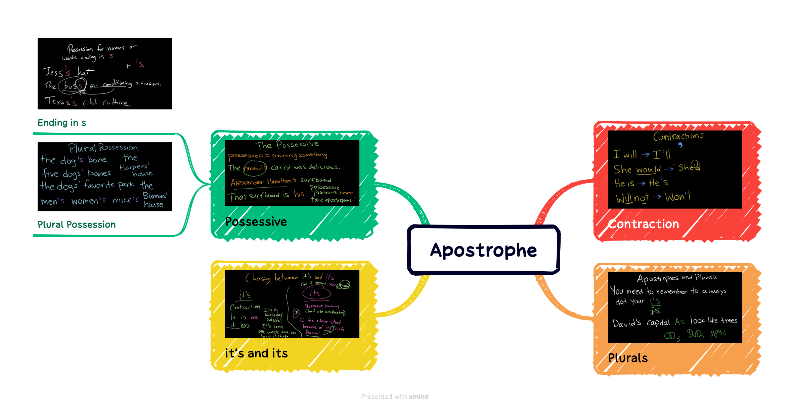

## 语法

## 词汇

|||
|:---:|:---:|
|genuinely| 英:/'dʒenjuinli/ 美:/ˈd ʒ ɛnjʊɪnlɪ/|
|withstand| 英:/wɪðˈstænd/ 美:/wɪðˈstænd/|
|bracing| 英:/ˈbreɪsɪŋ/ 美:/ˈbreɪsɪŋ/|
|simmer| 英:/ˈsɪmə(r)/ 美:/ˈsɪmər/|
|simmer down| |
|heated| 英:/ˈhiːtɪd/ 美:/ˈhiːtɪd/|
|validate| 英:/ˈvælɪdeɪt/ 美:/ˈvælɪdeɪt/|
|angle| 英:/ˈæŋɡl/ 美:/ˈæŋɡl/|
|mechanism| 英:/ˈmekənɪzəm/ 美:/ˈmekənɪzəm/|
|curiosity| 英:/ˌkjʊəriˈɒsəti/ 美:/ˌkjʊriˈɑːsəti/|
|statistic| 英:/stəˈtɪstɪk/ 美:/stəˈtɪstɪk/|
|convince| 英:/kənˈvɪns/ 美:/kənˈvɪns/|
|shift| 英:/ʃɪft/ 美:/ʃɪft/|
|ruin| 英:/ˈruːɪn/ 美:/ˈruːɪn/|
|inclination| 英:/ɪnklɪ'neɪʃ(ə)n/ 美:/'ɪnklə'neʃən/|
|pepper| 英:/ˈpepə(r)/ 美:/ˈpepər/|
|absorbing| 英:/əb'zɔːbɪŋ/ 美:/əb'sɔrbɪŋ/|
|fray| 英:/freɪ/ 美:/freɪ/|
|blow| 英:/bləʊ/ 美:/bloʊ/|

## 听力

SEGARRA: Naming what you see can be really helpful. OK, so we all agree - no fisticuffs. But if you are going to debate - takeaway four - do it respectfully and thoughtfully. Nedra says if this is your ***inclination***, you'll want to ask yourself first, if we have this conversation today, can we talk about this topic and then move on?

GLOVER TAWWAB: If having the debate will ***ruin*** the rest of the evening or the rest of the day for everyone, it can be a bit selfish, right? Now the tone of the holiday has ***shifted***. If you're able to say, no, this is what I think about this thing, and you all have some respectful back-and-forth dialogue, then you can do that.

SEGARRA: You should also ask yourself, what is my goal?

HEADLEE: If your goal is to change their mind, you can let that go now.

SEGARRA: They may change their minds over a long period of time and many conversations, but tonight - probably not.

HEADLEE: So if you remove that ***pressure*** of feeling like this conversation you're going to have is about either winning the conversation or ***convincing*** them with all your facts and ***statistics*** - if you let go of that, it really lowers the stakes.

SEGARRA: With that in mind, Celeste says you should plan to listen as much as you talk and be willing to learn something new.

HEADLEE: If you come from a place of ***curiosity***, of, tell me more about that because that is the opposite of everything I've heard - if you're coming from that place, you're much less likely to trigger defensive ***mechanisms***.

SEGARRA: Amy tells her clients to avoid the phrase, I hear you, because that can sometimes come across as, OK, you're done talking. It's my turn now. Instead, you could try...

LEW: So, like, oh, I really see that this and this and this is really important to you, or, I see you put a lot of thought into X, Y and Z, or, it makes sense that you would see it from this ***angle*** because of this reason - not because I'm agreeing with them in what their reason is. I can just understand where they're coming from. And that way, that other person really feels ***validated***.

SEGARRA: If you notice during this conversation that you're getting worked up or yelling and you don't want to be, ***reel it in***.

GLOVER TAWWAB: I'm realizing that this conversation that started off really respectful is getting too ***heated***, so I'm going to back away from the conversation and allow some other folks to talk. Or I'm going to, you know, maybe ***simmer down*** some, and we can talk about it a little bit more later. So talk about what you can do, and show up with your behaviors first.

SEGARRA: And Amy says when you're ready to end the debate or conversation, you can go back to one of our tools - redirect.

LEW: Look. I don't think we're going to ***see eye to eye*** on this thing. I do really care about you, and I'm glad that we talked about it because I want you to feel heard. But I think this is probably as much as we're going to agree. We might need to just agree to disagree tonight.

SEGARRA: The other thing to consider here - if you're always ***bracing*** yourself for family events, are these situations that you want to be in? And what boundaries will make them easier for you? Like, for instance, you might only spend four hours with your family on Christmas. That's your limit.

GLOVER TAWWAB: For the four hours that you have me, I will be my best self - 4.5, ugh (ph). You know, it's like, I'm losing it, you know? Five - I should have left at four. I know I should have left at four because now I am arguing with someone in the kitchen. So you know yourself better than the others there. And they may think, oh, you can ***withstand*** a bit more. And it's like, no, this is enough for me. And, you know, I'm going to leave now.

SEGARRA: Whatever happens, remember that you're most likely there at this holiday dinner to connect and to show love to your family. And Amy says if conflict arises, you can say that out loud.

LEW: So if possible - right? - if possible, if I ***genuinely*** do care about this person, I want to kind of throw it in there not to be super-flowery or super-sugary in my language. But I want to remind them, like, hey; you matter to me a little more than this conversation. So we're still good, but I think we need to end now.

SEGARRA: You heard the lady. ***Recap*** time - you are allowed to avoid conflict. Conflict avoidance is often framed as cowardly, like you're shying away from a moment of growth or ***opting out*** of an important conversation. But if you don't have the time and energy, it is OK to protect your peace. If you don't want to completely avoid conflict but you want to minimize it, keep your responses short. You can try deflecting, setting a boundary or redirecting. If you're not directly involved in a conflict but you see one brewing, try mediating or running interference. Figure out how you can be supportive. You know, if your family member has their phone on them, try texting them to check in or give them an exit. Hey, so-and-so. Want to help me in the kitchen real quick? Lastly, if you're going to engage in a debate, do it respectfully and thoughtfully. It helps to approach these conversations with genuine curiosity and a willingness to listen.

<iframe src="https://www.npr.org/player/embed/1196978388/1219103386" width="100%" height="290" frameborder="0" scrolling="no" title="NPR embedded audio player"></iframe>
