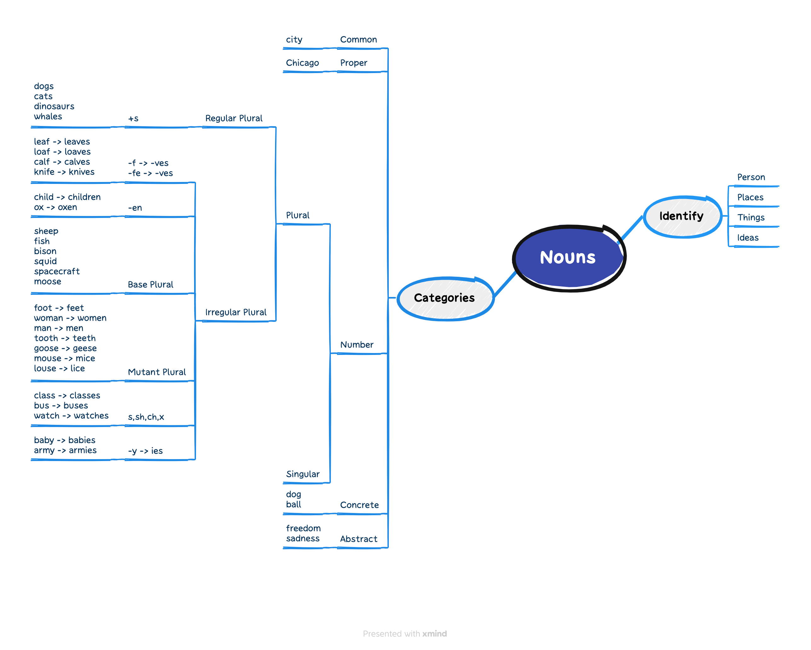

## 词汇

The two world wars, which interrupted the supply of ***raw meterial*** from Japan, also ***stifled*** the European ***silk*** industry.

||关于战争的词汇|
|:----:|:----:|
|battle |侧重指战争中的一次较全面、时间较长的战斗，也指陆军或海军在某一特定地区进行的战斗，或个人之间的争斗|
|war |是战争的总称，一般指包括多个战役的大规模战争|
|campaign |通常指在一场大的战争中在某一地区进行的一连串有既定目的的军事行动。也可作引申用|
|struggle |指激烈或时间持续长的战斗或奋力斗争|
|warfare |侧重指战争状态或具体的作战方法|
|fight |最普通用词，含义广，指战斗、斗争或打斗|
|combat |泛指军事行动，尤指小规模的战斗，甚至是格斗|
|engagement |指交战，交火|

|||
|:----:|:----:|
|troop| 英:/truːp/ 美:/truːp/|
|navy| 英:/ˈneɪvi/ 美:/ˈneɪvi/|
|mutiny| 英:/'mjuːtɪnɪ/ 美:/'mjutəni/|
|morale| 英:/məˈrɑːl/ 美:/məˈræl/|
|military| 英:/ˈmɪlətri/ 美:/ˈmɪləteri/|
|militant| 英:/ˈmɪlɪtənt/ 美:/ˈmɪlɪtənt/|
|flotilla| 英:/flə'tɪlə/ 美:/flo'tɪlə/|
|fleet| 英:/fliːt/ 美:/fliːt/|
|bellicose| 英:/ˈbelɪkəʊs/ 美:/ˈbelɪkoʊs/|
|armada| 英:/ɑː'mɑːdə/ 美:/ɑrˈmɑdə/|
|weapon| 英:/ˈwepən/ 美:/ˈwepən/|
|radar| 英:/ˈreɪdɑː(r)/ 美:/ˈreɪdɑːr/|
|fortress| 英:/'fɔːtrɪs/ 美:/'fɔrtrəs/|
|cannon| 英:/ˈkænən/ 美:/ˈkænən/|
|armament| 英:/ˈɑːməmənt/ 美:/ˈɑːrməmənt/|
|airfield| 英:/'eəfiːld/ 美:/'ɛrfild/|
|wreck| 英:/rek/ 美:/rek/|
|warfare| 英:/ˈwɔːfeə(r)/ 美:/ˈwɔːrfer/|
|truce| 英:/truːs/ 美:/truːs/|
|trespass| 英:/ˈtrespəs/ 美:/ˈtrespəs/|
|tactic| 英:/ˈtæktɪk/ 美:/ˈtæktɪk/|
|riot| 英:/ˈraɪət/ 美:/ˈraɪət/|
|revolt| 英:/rɪˈvəʊlt/ 美:/rɪˈvoʊlt/|
|repulse| 英:/rɪˈpʌls/ 美:/rɪˈpʌls/|
|rebellion| 英:/rɪ'beljən/ 美:/rɪ'bɛljən/|
|outbreak| 英:/ˈaʊtbreɪk/ 美:/ˈaʊtbreɪk/|
|onslaught| 英:/ˈɒnslɔːt/ 美:/ˈɑːnslɔːt/|
|martial| 英:/ˈmɑːʃl/ 美:/ˈmɑːrʃl/|
|invade| 英:/ɪnˈveɪd/ 美:/ɪnˈveɪd/|
|intrude| 英:/ɪnˈtruːd/ 美:/ɪnˈtruːd/|
|insurrection| 英:/ˌɪnsəˈrekʃn/ 美:/ˌɪnsəˈrekʃn/|
|exterminate| 英:/ɪkˈstɜːmɪneɪt/ 美:/ɪkˈstɜːrmɪneɪt/|
|envelop| 英:/ɪnˈveləp/ 美:/ɪnˈveləp/|
|enlist| 英:/ɪnˈlɪst/ 美:/ɪnˈlɪst/|
|encroach| 英:/ɪnˈkrəʊtʃ/ 美:/ɪnˈkroʊtʃ/|
|encircle| 英:/ɪn'sɜːk(ə)l/ 美:/ɪn'sɝkl/|
|disarmament| 英:/dɪsˈɑːməmənt/ 美:/dɪsˈɑːrməmənt/|
|disarm| 英:/dɪsˈɑːm/ 美:/dɪsˈɑːrm/|
|diplomacy| 英:/dɪ'pləʊməsɪ/ 美:/dɪ'ploməsi/|
|defense| 英:/dɪˈfens/ 美:/dɪˈfɛns/|
|defeat| 英:/dɪˈfiːt/ 美:/dɪˈfiːt/|
|conquer| 英:/ˈkɒŋkə(r)/ 美:/ˈkɑːŋkər/|
|confidential| 英:/ˌkɒnfɪˈdenʃl/ 美:/ˌkɑːnfɪˈdenʃl/|
|combat| 英:/ˈkɒmbæt/ 美:/ˈkɑːmbæt/|
|collision| 英:/kəˈlɪʒn/ 美:/kəˈlɪʒn/|
|classified| 英:/ˈklæsɪfaɪd/ 美:/ˈklæsɪfaɪd/|
|campaign| 英:/kæmˈpeɪn/ 美:/kæmˈpeɪn/|
|bomb| 英:/bɒm/ 美:/bɑːm/|
|blockade| 英:/blɒˈkeɪd/ 美:/blɑːˈkeɪd/|
|besiege| 英:/bɪˈsiːdʒ/ 美:/bɪˈsiːdʒ/|
|assault| 英:/əˈsɔːlt/ 美:/əˈsɔːlt/|
|aggressive| 英:/əˈɡresɪv/ 美:/əˈɡresɪv/|
|industry| 英:/ˈɪndəstri/ 美:/ˈɪndəstri/|
|silk| 英:/sɪlk/ 美:/sɪlk/|
|stifle| 英:/ˈstaɪfl/ 美:/ˈstaɪfl/|
|raw| 英:/rɔː/ 美:/rɔː/|
|interrupt| 英:/ˌɪntəˈrʌpt/ 美:/ˌɪntəˈrʌpt/|

## 语法

## 听力

OK. No. 2 - keep your house as dust-free as possible. Dust is made up of a lot of things - ***fibers*** from clothing and ***rugs***, hair, dead skin cells - I know, don't think about it too much - but also ***chemicals*** - for instance, from your shoes. As you walk around outside, you're picking up all kinds of things on your feet.

FERRO: Some of those pollutants include road dust - you know, so heavy metals and other things that end up in the road - and then also ***pesticides*** from ***lawn*** applications or other applications.

SEGARRA: You don't need to be ***licking*** your floors to ***ingest*** this stuff.

FERRO: That's right. So, you know, once those pollutants are part of the dust, you could kick up the dust quite easily and breathe it.

SEGARRA: An easy fix? Take off your shoes at the door of your house. And hey, bonus, when you do this, you're much less likely to find yourself on your hands and knees, scraping a piece of chewed gum off your hardwood floor. Happened to me. Also, dust your home regularly.

FERRO: I think the best way is just avoiding dry dusting. So if you have a ***damp*** cloth, that's the best because...

SEGARRA: OK.

FERRO: ...You're not then putting the dust back into the air.

SEGARRA: Ferro says you should also get yourself a good ***vacuum*** with a HEPA filter, if possible. That stands for high-efficiency particulate air filter. According to the Environmental Protection Agency, those can theoretically remove at least 99.97% of dust, pollen, ***mold***, ***bacteria*** and many other airborne particles. When you're cleaning, remember to open a window and also think about what cleaning fluids you're using and any potential health risks associated with them. Maybe try using ***vinegar*** or dish soap plus a little ***elbow grease*** first. See if that works.

The other thing to look for when you're cleaning - and this is our No. 3 - is mold. You've probably seen it in your bathroom. It can also grow on surfaces like drywall and paint and even in dust. Nellie Brown is a certified industrial hygienist and a director of workplace health and safety programs at Cornell University.

NELLIE BROWN: Most of the time, what draws people's attention to the fact that there might be a mold issue is either some type of ***odor*** - a moldy or musty odor - or they see signs of water damage. They see floor tiles lifting up or wallpaper coming off. They see stains coming through drywall or showing up on ceiling tiles or on ceilings.

SEGARRA: The problem is mold releases ***spores*** into the air that can cause ***allergic*** reactions or trigger asthma symptoms. Brown says if you have visible mold, your first step is to figure out what's causing it. Is there a leak under your sink or maybe in your ceiling? Where is the ***moisture*** coming from? You'll want to fix that and then figure out how big of a cleanup job you've got. The EPA says that if the moldy patch is less than 10 square feet - so that's about three foot by three foot - you could probably handle it yourself. Brown says you should also consider where the water damage came from before you make repairs.

BROWN: If the source of the water is one in which you are going to find yourself needing to sue someone - a **landlord** or, you know, someone did a bad repair on your ***sewer*** line or something - then you really want to have a report from a licensed mold inspector before you do any remediation work.

SEGARRA: If you do the cleanup yourself, she suggests putting on some ***goggles***, ***rubber*** gloves and an N95 respirator. Then, if the mold is on a hard surface, scrub it down with dishwashing soap and water.

BROWN: A lot of people think ***bleach*** is the answer to everything. And the reality is all that happens is people get more ***bleach*** exposure, ***inhalation*** exposure to it, accidental eye or skin exposure. It's a very ***harsh*** material, and it's usually a lot more than people really need.

SEGARRA: Now, the goal here is to make sure you're removing the mold. So if it's a ***porous*** surface like ***drywall***, you may have to cut out a section. And if we're talking about something like ***fabric*** ***upholstery***, you just need to throw it out.

BROWN: A lot of things, you know, you just can't salvage.

SEGARRA: And then you can prevent mold in the future by keeping your house as dry as possible. One tip from Brown - think carefully before you get a ***humidifier***.

BROWN: I'm always very cautious when people say, wow, you know, it's been such a dry winter. I'm thinking of adding a humidifier. Well, here's the problem. If I were you, I would think about how many days of dry weather you really think you can't ***tolerate***. Because the problem is when you start then adding moisture to the air, you can end up with ***condensation*** and start creating mold problems you don't want.

<iframe src="https://www.npr.org/player/embed/1174308607/1174877532" width="100%" height="290" frameborder="0" scrolling="no" title="NPR embedded audio player"></iframe>
