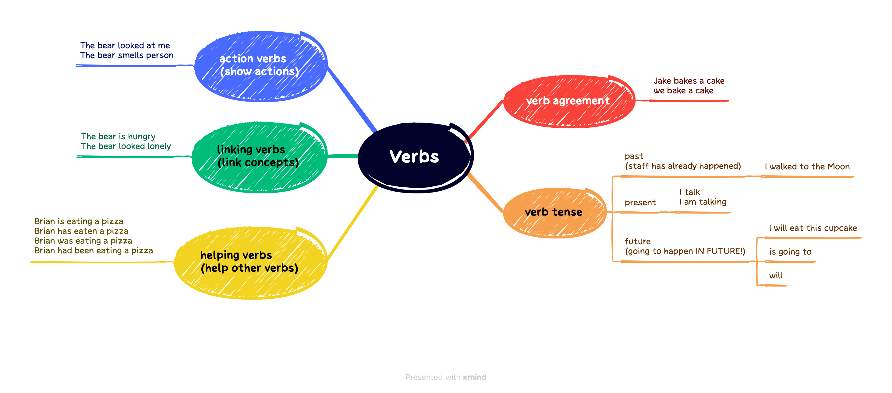

## 词汇

Migration is a complex issue, and biologists define it differently, depending in part on what sorts of animals they study.

"in part" 则是用来强调这种依赖是部分性的，不是唯一的因素

|||
|:---:|:---:|
|squeak| 英:/skwiːk/ 美:/skwik/|
|spawn| 英:/spɔːn/ 美:/spɔn/|
|reproduce| 英:/ˌriːprəˈdjuːs/ 美:/ˌriːprəˈduːs/|
|pregnant| 英:/ˈpreɡnənt/ 美:/ˈpreɡnənt/|
|peck| 英:/pek/ 美:/pek/|
|nest| 英:/nest/ 美:/nest/|
|migratory| 英:/'maɪgrət(ə)rɪ/ 美:/'maɪɡrətɔri/|
|leap| 英:/liːp/ 美:/liːp/|
|hatch| 英:/hætʃ/ 美:/hætʃ/|
|gregarious| 英:/ɡrɪˈɡeəriəs/ 美:/ɡrɪˈɡeriəs/|
|graze| 英:/ɡreɪz/ 美:/ɡreɪz/|
|estivation| 英:/ˌiːstɪ'veɪʃən/ 美:/ˌɛstəˈveʃən/|
|dormancy| 英:/ˈdɔːmənsi/ 美:/ˈdɔːrmənsi/|
|chirp| 英:/tʃɜːp/ 美:/tʃɜːrp/|
|suborder| 英:/'sʌbɔːdə/ 美:/sʌb'ɔdɚ/|
|scavenger| 英:/'skævɪn(d)ʒə/ 美:/'skævɪndʒɚ/|
|rodent| 英:/'rəʊd(ə)nt/ 美:/'rodnt/|
|quarry| 英:/'kwɒrɪ/ 美:/'kwɔri/|
|primate| 英:/'praɪmeɪt/ 美:/'praɪmet/|
|prey| 英:/preɪ/ 美:/preɪ/|
|predator| 英:/ˈpredətə(r)/ 美:/ˈpredətər/|
|poikilotherm| 英:/'pɔikiləθə:m/ 美:/pɔɪˈkɪləˌθɚm/|
|omnivorous| 英:/ɒmˈnɪvərəs/ 美:/ɑːmˈnɪvərəs/|
|vertebrate| 英:/ˈvɜːtɪbrət/ 美:/ˈvɜːrtɪbrət/|
|invertebrate| 英:/ɪn'vɜːtɪbrət/ 美:/ɪn'vɝtɪbret/|
|homotherm| /'həuməθə:m/|
|herbivore| 英:/'hə:bivɔ:/ 美:/ˈhə..bəˌvɔr/|
|herbivorous| 英:/hɜːˈbɪvərəs/ 美:/ɜːrˈbɪvərəs/|
|habitat| 英:/ˈhæbɪtæt/ 美:/ˈhæbɪtæt/|
|family| 英:/'fæməli/ 美:/ˈfæməli/|
|domesticate| 英:/dəˈmestɪkeɪt/ 美:/dəˈmestɪkeɪt/|
|domestic| 英:/dəˈmestɪk/ 美:/dəˈmestɪk/|
|coelenterate| 英:/siː'lent(ə)rət/ 美:/sɪ'lɛntəret/|
|carnivore| 英:/'kɑːnɪvɔː/ 美:/'kɑrnɪvɔr/|
|aquatic| 英:/əˈkwætɪk/ 美:/əˈkwɑːtɪk/|
|zoology| 英:/zuˈɒlədʒi/ 美:/zuˈɑːlədʒi/|
|zebra| 英:/ˈzebrə/ 美:/ˈzibrə/|
|yak| 英:/jæk/ 美:/jæk/|
|woodpecker| 英:/'wʊdpekə/ 美:/'wʊdpɛkɚ/|
|whale| 英:/weɪl/ 美:/weɪl/|
|seal| 英:/siːl/ 美:/siːl/|
|Rhinoceros| 英:/raɪ'nɒs(ə)rəs/ 美:/raɪ'nɑsərəs/|
|reindeer| 英:/'reɪndɪə/ 美:/'rendɪr/|
|pony| 英:/'pəʊnɪ/ 美:/'poni/|
|ox| 英:/ɒks/ 美:/ɑːks/|
|niche| 英:/niːʃ/ 美:/niʃ/|
|marmot| 英:/'mɑːmət/ 美:/'mɑrmət/|
|koala| 英:/kəʊ'ɑːlə/ 美:/ko'ɑlə/|
|horn| 英:/hɔːn/ 美:/hɔːrn/|
|horde| 英:/hɔːd/ 美:/hɔrd/|
|hippo| 英:/'hɪpəʊ/ 美:/ˈhɪpo/|
|herd| 英:/hɜːd/ 美:/hɜːrd/|
|gorilla| 英:/gə'rɪlə/ 美:/ɡəˈrɪlə/|
|giraffe| 英:/dʒɪ'rɑːf/ 美:/dʒə'ræf/|
|gibbon| 英:/'gɪb(ə)n/ 美:/'ɡɪbən/|
|genus| 英:/ˈdʒiːnəs/ 美:/ˈdʒiːnəs/|
|fauna| 英:/'fɔːnə/ 美:/'fɔnə/|
|donkey| 英:/ˈdɒŋki/ 美:/ˈdɑːŋki/|
|chimpanzee| 英:/tʃɪmpæn'ziː/ 美:/ˌtʃɪmpæn'zi/|
|camel| 英:/ˈkæml/ 美:/ˈkæml/|
|buffalo| 英:/ˈbʌfələʊ/ 美:/ˈbʌfəloʊ/|
|beaver| 英:/'biːvə/ 美:/'bivɚ/|
|beast| 英:/biːst/ 美:/biːst/|
|bat| 英:/bæt/ 美:/bæt/|
|sort| 英:/sɔːt/ 美:/sɔːrt/|
|define| 英:/dɪˈfaɪn/ 美:/dɪˈfaɪn/|
|biologist| 英:/baɪˈɒlədʒɪst/ 美:/baɪˈɑːlədʒɪst/|
|issue| 英:/ˈɪʃuː/ 美:/ˈɪʃuː/|
|migration| 英:/maɪˈɡreɪʃn/ 美:/maɪˈɡreɪʃn/|

## 语法

## 听力

SEGARRA: All right. So while you're cleaning surfaces around the house, why not clean the air, too? That's No. 4 - get yourself an air cleaner or make one. Air cleaners are machines that filter the air in your home. You'll want to get one with a HEPA filter. That'll remove fine particles. Even better, if the filter also has ***activated carbon*** in it 'cause that can trap ***volatile organic compounds*** in the air, like the kind that come from ***paints*** or cleaning products. Ferro says when you're buying an air cleaner, pay attention to its clean air delivery rate.

FERRO: Basically, how much - what square ***footage*** of area that it will clean.

SEGARRA: That can tell you if you need a bigger machine or maybe a few of them. If you're looking for a more budget-friendly way to filter your air, there are ***instructions*** for how to build one online. And one of the experts we talked to recommended that.

OK. No. 5 on our list is test your air. Air sensors can measure the levels of pollutants in your home, things like fine particles, ozone, carbon dioxide and nitrogen dioxide. And if you buy a sensor, you can use it to get smarter about what you do at home and when you need to ventilate. Ferro says you might be surprised by what you learn. Like, she lives on a bus route. And one time, she had students come to her house to show them the impact that would have on her air quality.

FERRO: I had students come to my house. I said, well, the buses are coming by every day. So you will see the increase in the particulate matter indoors in my house. And so we put the sensors in the house, or at this point, it was more expensive monitors. And really what we could see more than the buses was us making tea, turning on the stove (laughter).

SEGARRA: Oh.

FERRO: It was a much bigger signal than having, you know, 25, 30 buses drive by my house, ***idling***, because I lived near the stop sign. So that was quite interesting because the buses are an outdoor source, so only some of that makes it indoors, but that stove is an indoor source and so the pollutant levels rose very quickly.

SEGARRA: Ferro's family had just moved into the house, so they didn't have a range hood over the gas stove yet, but she got one after that. But again, you've got to make changes that are possible for you. If you can't afford to install a fan over the stove, maybe you start opening a window and using other ***appliances*** when you can, like an electric tea ***kettle*** to heat water. If you are looking for an air sensor, the EPA has a website with suggestions. And Ferro says the Air Pollution Control Agency for Southern California has also tested the quality of air sensors on the market. And you can find those results on its website. She says, keep in mind, some air sensors are not the most user friendly because they spit out an overwhelming amount of data without telling you what it all means.

FERRO: These air quality sensors typically will give you a reading every minute. So, you know, after a day you've got 1,440 readings. So what do you do with all this? So I suggest using a company or working with a company that also helps you ***interpret*** the data.

SEGARRA: One pollutant that your air sensor might not pick up, but you should consider testing for, is radon. Radon is a naturally ***occurring*** ***radioactive*** gas that comes from bits of ***uranium*** that are ***decaying*** in our ***soil***, our ***rocks*** and our water. It ***seeps into*** our homes through ***cracks*** in the floor and the walls or gaps around pipes. And it can cause lung cancer ***over time***. According to the CDC, it's actually the second leading cause of lung cancer in the U.S. after cigarette smoking.

It's hard to ***get rid of*** radon entirely, but you can lower your risk. First, though, you'll want to find out how bad the problem is. And you can do that with an at-home radon test kit. You'll order it online, set it on a table for two to three days, and then mail it back. In some states you can get a test kit for free. That's what I just did in New York. And you can also buy one for $17 from National Radon Program Services, a partnership between the EPA and the University of Kansas.

If your radon levels are higher than the EPA's recommended threshold, the agency suggests that you hire a ***contractor*** to fix your home because it does require some technical knowledge and special skills. And if you do it wrong, you could make the problem worse. If you do take on the work, some state radon offices offer training courses.

One thing we want to note here is we understand it may be harder to do things like get a radon ***remediation*** or a mold cleanup professional if you rent than if you own. Because you've got to get your landlord involved, and they might be slow to respond, or they might say it's not really a problem. That's why testing or getting official estimates can be really helpful. But this is a bigger conversation and it's a topic for another episode of LIFE KIT. And actually, we do have one coming up on how to be an ***empowered*** renter.

OK, it's time for a ***recap*** - a few simple things you can do to improve the air quality in your home. Open the windows. Keep your house as dust-free as possible. That means take off your shoes at the door. Clean up your mold. Buy an air cleaner, or make one. And test your air - in particular, get yourself a radon test kit.

And look, you don't have to do all of these things. We live in the world. Risks are everywhere, and we're never going to create a 100% safe environment. But this is about being safer and making trade-offs and smart choices when you can.

<iframe src="https://www.npr.org/player/embed/1174308607/1174877532" width="100%" height="290" frameborder="0" scrolling="no" title="NPR embedded audio player"></iframe>