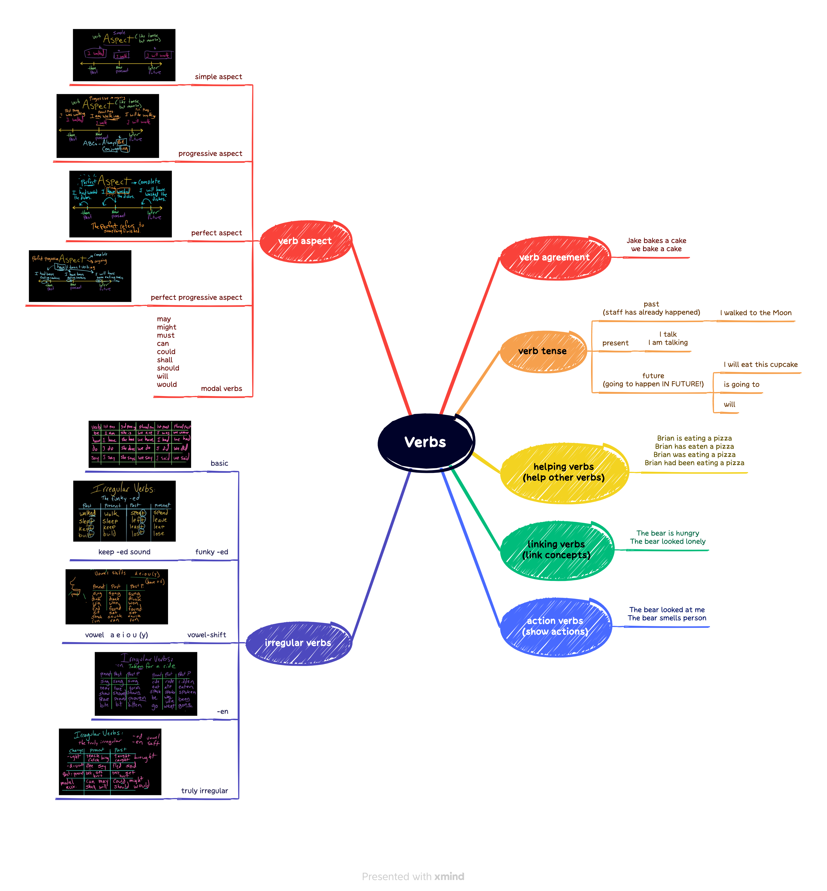

## 词汇

One way is by organising backstage ***tours***, so people can be ***shown round*** the building and learn how a theatre operates.
|||
|:---:|:---:|
|manner| 多指行动的特殊方式或独特的方法|
|method| 指有系统、有条理地办事或解决问题的方法|
|way| 普通用词，可指一般的方法，有时也指个人的方法或方式，也可指特殊的方式或方法|
|mode| 书面用词，常指因个人爱好或传统习俗等因素而遵循的方法|
|fashion| 着重独特的程序或方式，尤指个人的偏爱或习惯|
|means| 指为达到某种目的或目标而采用的方法、手段或途径|
|approach| 指从事某事的特别方法、途径|

|||
|:---:|:---:|
|shortcut| 英:/'ʃɔːtkʌt/ 美:/'ʃɔrt,kʌt/|
|procedure| 英:/prəˈsiːdʒə(r)/ 美:/prəˈsiːdʒər/|
|pathway| 英:/'pɑːθweɪ/ 美:/'pæθwe/|
|method| 英:/ˈmeθəd/ 美:/ˈmeθəd/|
|means| 英:/miːnz/ 美:/miːnz/|
|forthright| 英:/ˈfɔːθraɪt/ 美:/ˈfɔːrθraɪt/|
|fashion| 英:/ˈfæʃn/ 美:/ˈfæʃn/|
|direct| 英:/dɪˈrekt/ 美:/dɪ'rekt/|
|avenue| 英:/ˈævənjuː/ 美:/ˈævənuː/|
|approach| 英:/əˈprəʊtʃ/ 美:/əˈproʊtʃ/|
|stagehand| 英:/'steɪdʒhænd/ 美:/'stedʒhænd/|
|repertoire| 英:/ˈrepətwɑː(r)/ 美:/ˈrepərtwɑːr/|
|mime| 英:/maɪm/ 美:/maɪm/|
|interval| 英:/ˈɪntəvl/ 美:/ˈɪntərvl/|
|impersonate| 英:/ɪmˈpɜːsəneɪt/ 美:/ɪmˈpɜːrsəneɪt/|
|heroine| 英:/ˈherəʊɪn/ 美:/ˈheroʊɪn/|
|hero| 英:/'hɪərəʊ/ 美:/'hɪro/|
|funnyman| 英:/'fʌnɪ,mæn/ 美:/ˈfʌniˌmæn/|
|curtain| call |
|curtain| 英:/ˈkɜːtn/ 美:/ˈkɜːrtn/|
|comedian| 英:/kə'miːdɪən/ 美:/kə'midɪən/|
|act| 英:/ækt/ 美:/ækt/|
|tragedy| 英:/ˈtrædʒədi/ 美:/ˈtrædʒədi/|
|sitcom| 英:/'sɪtkɒm/ 美:/ˈsɪtˌkɑm/|
|sentimental| 英:/sentɪ'ment(ə)l/ 美:/'sɛntə'mɛntl/|
|satirical| 英:/sə'tɪrɪk(ə)l/ 美:/sə'tɪrɪkl/|
|pantomime| 英:/ˈpæntəmaɪm/ 美:/ˈpæntəmaɪm/|
|opera| 英:/ˈɒprə/ 美:/ˈɑːprə/|
|farce| 英:/fɑːs/ 美:/fɑːrs/|
|comedy| 英:/ˈkɒmədi/ 美:/ˈkɑːmədi/|
|Thespian| 英:/'θespɪən/ 美:/'θɛspɪən/|
|script| 英:/skrɪpt/ 美:/skrɪpt/|
|puppet| 英:/'pʌpɪt/ 美:/'pʌpɪt/|
|playwright| 英:/ˈpleɪraɪt/ 美:/ˈpleɪraɪt/|
|offstage| 英:/ˌɒfˈsteɪdʒ/ 美:/ˌɔːfˈsteɪdʒ/|
|monologue| 英:/ˈmɒnəlɒɡ/ 美:/ˈmɑːnəlɔːɡ/|
|plot| 英:/plɒt/ 美:/plɑːt/|
|drama| 英:/ˈdrɑːmə/ 美:/ˈdrɑːmə/|
|dialogue| 英:/'daɪəlɒg/ 美:/'daɪəlɑɡ/|
|tragic| 英:/ˈtrædʒɪk/ 美:/ˈtrædʒɪk/|
|a tragic ending| |
|backstage| 英:/bæk'steɪdʒ/ 美:/ˌbæk'stedʒ/|
|theatre| 英:/'θiətə/ 美:/ˈθiətɚ/|

## 语法

## 听力

SEGARRA: Hey, everybody. It's Marielle. We're going to start today's episode at the top of a hill with Emma Tempest. Back when she was a teacher, she would take her class of 4- and 5-year-olds to the park for an end-of-year celebration.

EMMA TEMPEST: And it was at the top of this ***enormous*** hill. And every year, we'd have a rolling down the hill competition. And all the adults would join in because you just had - you had that permission to have fun.

SEGARRA: The other part of that celebration was a trip to a mini zoo.

TEMPEST: You'd hear the children saying things like, oh, I wonder what that fish is thinking? And you'd be like, what? I've never thought about that before.

SEGARRA: That ***spirit*** of ***imagination*** and ***wonder*** - you can take that with you anywhere, and it costs nothing. Emma is now a positive psychology coach who helps people ***get unstuck*** through play. We did an episode last week about play - what it is, why it's good for you and how to do more of it. And in the process of reporting that episode, we came up with a ***whole bunch of*** ideas for how to play for cheap 'cause you don't have to spend a lot of money to have fun.

TEMPEST: Don't let money or time be the thing that decides whether or not you will have fun. You can have fun almost ***in spite of*** those things if you really ***put your mind to it***.

SEGARRA: On this episode of LIFE KIT, we're going to share those ideas for how to have fun ***on a budget***. Think of these as offerings. Try them out. See what you like and see if they ***spark*** any ideas of your own.

SEGARRA: All right. We're ***breaking this episode up into categories***. And since this story started at a park, we'll begin with the outdoors. If you want to have cheap fun outside, public parks and beaches are your best friend. You can go there and fly a kite or ride a bike, have a ***picnic***. LIFE KIT producer Margaret Cirino does that a lot in New York.

MARGARET CIRINO, BYLINE: I'll get all my friends and ***pack up*** my little ***hammock*** and pack up some ***snacks***, like strawberries and fresh fruits and ***crackers(饼干)***. And we'll all, like, ***lay out*** our ***blankets*** together and make, like, one ***giant*** seating area and then just be there for ***literally hours***. And just, like, we'll snack, and we'll be hammocking, and we'll be talking. And some of us will be ***crafting***, and we all have our little books. And it's all just, like, very cute and ***wholesome***.

SEGARRA: Or you could get a bunch of friends together for a ***field day***. I'm talking about a three-legged race, egg on a ***spoon***, ***water balloon toss***. Use your imagination, which also comes in handy if you want to do some kind of park cleanup. Picking up trash or fallen tree branches - it's easy to make that a game. ***Coat*** ***hangers*** can ***double as（兼具两种不同的功能）*** ***pirate*** ***swords***, and ***plastic*** bags can be ***bandanas***. Or you could get to know the ***creatures*** and plants that live in the park.

CIRINO: So there's, like, a lot of free apps out there that, like, that allow you to, like, unlock these ***sciencey hobbies*** where you're just going on a walk, but you're, like, looking for this specific kind of bug or this bird. And then you can log it into these apps. It's almost like a game, but it's helping them collect, like, citizen science, like, data while you're doing it.

SEGARRA: By the way, LIFE KIT has an episode on birding and another on how to be a ***community scientist***. Another tip - a lot of parks will have outdoor workout ***equipment*** that you can use for ***body weight exercises***. Also, a lot of parks offer free programming, jazz music, ***salsa*** lessons, bingo. If you go to the website of your local park or parks department, they may have an events calendar.

OK. Moving beyond parks, another outdoors idea which is perfect for exploring a neighborhood or a city is something called a ***penny date(硬币约会)***.

NICOLE DOW: A penny date really kind of gets you out to explore things ***without an objective***.

SEGARRA: This idea comes from Nicole Dow. She's a ***freelance*** writer who wrote a piece about how to have cheap fun for a personal finance website called The Penny Hoarder. Here's how penny date works. You take a penny or any other coin, really, and pick a direction for heads and tails.

DOW: Heads will be left. Tails will be right or ***vice versa（反过来）***. And then you flip the coin, see what direction it takes you, and that's where you go.

SEGARRA: And you stop when you see something interesting. Maybe you land in front of a building that has really cool architecture, and you do an online search about its history. Another idea from Nicole - go to the farmer's market. Make a morning of it. You don't have to buy anything.

DOW: A lot of times, farmer's markets will offer not just ***vendors*** selling things, but they'll have local people singing or playing an instrument. And that's a great form of free entertainment. And there's always ***free samples*** out from vendors.

SEGARRA: Oh, and how about a ***parade***? Any of those going on in your city or town? Could be fun. Lots of ***merriment***. OK. Our next category is arts and crafts. If your idea of play is being creative and making things, the classic move is to get a coloring book and ***crayons*** or a paint-by-numbers set, or you could get a little more ***elaborate***. Our producer Margaret likes to host art nights with friends at her apartment. She'll get some cheap, colorful clay at the craft store, and they'll make mini ***sculptures*** or ***jewelry*** while watching a movie.

<iframe src="https://www.npr.org/player/embed/1191071743/1191082232" width="100%" height="290" frameborder="0" scrolling="no" title="NPR embedded audio player"></iframe>
