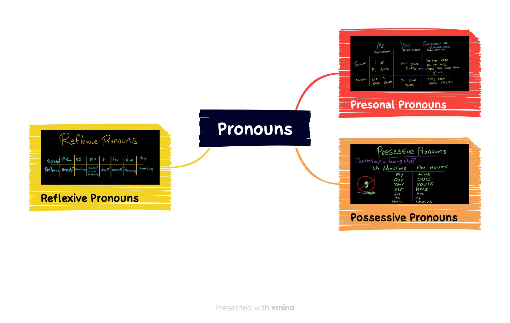

## 词汇

What I'm afraid will happen is that books and magazines will all disappear, and there'll just be rows and rows of computers.

|||
|:---:|:---:|
|quarterly| 英:/ˈkwɔːtəli/ 美:/ˈkwɔːrtərli/|
|publisher| 英:/'pʌblɪʃə/ 美:/'pʌblɪʃɚ/|
|publication| 英:/ˌpʌblɪˈkeɪʃn/ 美:/ˌpʌblɪˈkeɪʃn/|
|paperback| 英:/ˈpeɪpəbæk/ 美:/ˈpeɪpərbæk/|
|newssheet| /'njuːzʃiːt/|
|newsprint| 英:/'njuːzprɪnt/ 美:/'nuzprɪnt/|
|newspaper| 英:/'njuːzpeɪpə/ 美:/'nuzpepɚ/|
|newsboy| 英:/'njuːzbɒɪ/ 美:/ˈnuzˌbɔɪ/|
|literary| 英:/ˈlɪtərəri/ 美:/ˈlɪtəreri/|
|journal| 英:/ˈdʒɜːnl/ 美:/ˈdʒɜːrnl/|
|headline| 英:/ˈhedlaɪn/ 美:/ˈhedlaɪn/|
|organ| 英:/ˈɔːɡən/ 美:/ˈɔːrɡən/|
|fortnightly| 英:/'fɔːtnaɪtlɪ/ 美:/'fɔrtnaɪtli/|
|encyclopedia| 英:/ɪnˌsaɪkləˈpiːdiə/ 美:/ɪnˌsaɪkləˈpiːdiə/|
|editor|-in-chief /'ɛditə in 'tʃi:f/|
|distribution| 英:/ˌdɪstrɪˈbjuːʃn/ 美:/ˌdɪstrɪˈbjuːʃn/|
|contributor| 英:/kənˈtrɪbjətə(r)/ 美:/kənˈtrɪbjətər/|
|columnist| 英:/ˈkɒləmnɪst/ 美:/ˈkɑːləmnɪst/|
|column| 英:/ˈkɒləm/ 美:/ˈkɑːləm/|
|circulation| 英:/ˌsɜːkjəˈleɪʃn/ 美:/ˌsɜːrkjəˈleɪʃn/|
|anthology| 英:/æn'θɒlədʒɪ/ 美:/ænˈθɑlədʒi/|
|advertising| 英:/ˈædvətaɪzɪŋ/ 美:/ˈædvərtaɪzɪŋ/|
|vanish| 英:/ˈvænɪʃ/ 美:/ˈvænɪʃ/|
|linger| 英:/ˈlɪŋɡə(r)/ 美:/ˈlɪŋɡər/|
|fade| 英:/feɪd/ 美:/feɪd/|
|extinct| 英:/ɪkˈstɪŋkt/ 美:/ɪkˈstɪŋkt/|
|evaporation| 英:/i,væpə'reiʃən/ 美:/ɪˌvæpəˈreʃən/|
|evaporate| 英:/ɪˈvæpəreɪt/ 美:/ɪˈvæpəreɪt/|
|uneasy| 英:/ʌnˈiːzi/ 美:/ʌnˈiːzi/|
|anxious| 英:/ˈæŋkʃəs/ 美:/ˈæŋkʃəs/|
|alarm| 英:/əˈlɑːm/ 美:/əˈlɑːrm/|
|afraid| 英:/ə'freɪd/ 美:/ə'fred/|

## 语法

## 听力

CIRINO: Or, like, a lot of the times, we'll, like, just get paper and each, like, have a little ***canvas*** and just paint for five minutes and then swap. And that's always really fun cause, like, the art is really ***wacky*** and weird.

SEGARRA: Sometimes, they'll give each other prompts they have to ***stick to***. Like, a recent one was secrets.

CIRINO: And we all had to, like, make our art secret-themed or, like, something you're not supposed to know. Like, shh.

SEGARRA: If you'd rather go see or hear some art, look at the events calendars for your local coffee shops and bars and restaurants. They could be hosting open-mic nights or ***poetry*** ***slams***. Janet Woojeong Lee is a producer on NPR's education desk. And sometimes, she goes to mystery movie screenings at this local theater on Wednesday nights.

JANET WOOJEONG LEE, BYLINE: How it works is that you don't know what movie you're going to be watching until you get there, but it's entirely free. So if I wanted to ***grab a bite*** or drink afterwards, like I felt less ***guilty*** about it.

SEGARRA: They turned out to be films she wouldn't have seen otherwise. And if you don't have this option in your city, you can do it with friends at your house. One of you picks the movie and then surprises the rest of the group. Another tip from Janet - a lot of museums are free one day a week, and your local library might also offer free museum passes too. You just have to reserve them ahead of time.

OK. Our next category is food. One idea is to recreate a family recipe. Ask your mom for her mom's famous ***meatloaf*** recipe, or look online for a meal that your ***ancestors*** might have eaten. This is a beautiful practice on your own or with a group. And when you're doing this, don't focus on perfection or an exact ***recreation***. Here's what Chef Joudie Kalla had to say about that in another LIFE KIT episode.

JOUDIE KALLA: Comparison is like a killer. When you compare things to other people, you lose your confidence, whatever it might be. It's not your mom's or your grandmother's. It's your own. I cook a lot, and I cannot cook my mom's quality food ever - never - because everybody ***has their own touch***.

SEGARRA: Now, if you don't feel like making your food, how about a food challenge or a taste test? LIFE KIT producer Sylvie Douglis likes to do those with her partner.

SYLVIE DOUGLIS, BYLINE: And last time we were in Canada, someone told us that Canadian chocolate is much chocolatier-tasting. So we got some Kit Kats to do a taste test with.

SEGARRA: They like the Canadian ones better. You can do this with different brands of vanilla ice cream.

DOUGLIS: Or you could go to your local ***bodega*** and, like, try a bunch of different brands of, like, the same ***flavor*** chip.

SEGARRA: ***The sky's the limit here***.

<iframe src="https://www.npr.org/player/embed/1191071743/1191082232" width="100%" height="290" frameborder="0" scrolling="no" title="NPR embedded audio player"></iframe>