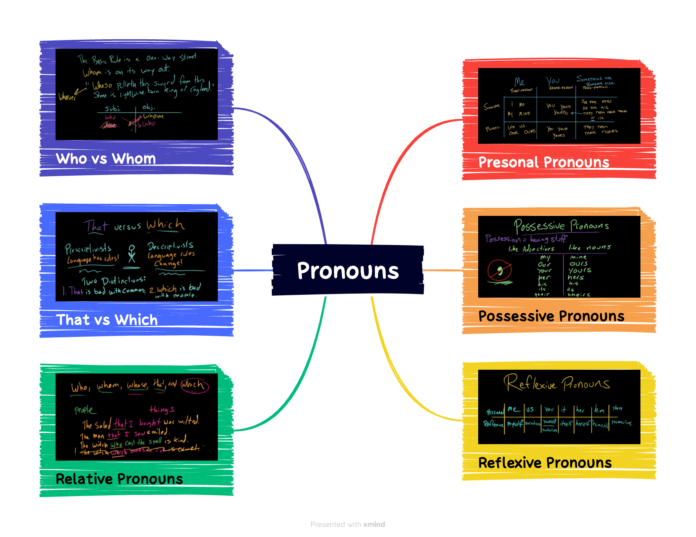

## 语法

## 词汇

|||
|:---:|:---:|
dip| 英:/dɪp/ 美:/dɪp/|
safekeeping| 英:/ˌseɪf 'kiːpɪŋ/ 美:/'sef'kipɪŋ/|
capsule| 英:/ˈkæpsjuːl/ 美:/ˈkæpsl/|
volcano| 英:/vɒlˈkeɪnəʊ/ 美:/vɑːlˈkeɪnoʊ/|
vinegar| 英:/ˈvɪnɪɡə(r)/ 美:/ˈvɪnɪɡər/|
outfits| /'autfit/|
silly| 英:/'sɪlɪ/ 美:/'sɪli/|
vintage| 英:/ˈvɪntɪdʒ/ 美:/ˈvɪntɪdʒ/|
backstory| |
decor| 英:/ˈdeɪkɔ:/ 美:/de'kɔr/|
whim| 英:/wɪm/ 美:/wɪm/|
sibling| 英:/ˈsɪblɪŋ/ 美:/ˈsɪblɪŋ/|
gorgeous| 英:/ˈɡɔːdʒəs/ 美:/ˈɡɔːrdʒəs/|
full|-fledged 英:/'ful'fledʒd/ 美:/ˈfʊlˈflɛdʒd/|
freelance| 英:/ˈfriːlɑːns/ 美:/ˈfriːlæns/|
grudge| 英:/ɡrʌdʒ/ 美:/ɡrʌdʒ/|
around| 英:/ə'raʊnd/ 美:/ə'raʊnd/|
fierce| 英:/fɪəs/ 美:/fɪrs/|
averse| 英:/əˈvɜːs/ 美:/əˈvɜːrs/|
crocodile| 英:/ˈkrɒkədaɪl/ 美:/ˈkrɑːkədaɪl/|
indicator| 英:/ˈɪndɪkeɪtə(r)/ 美:/ˈɪndɪkeɪtər/|
stake| 英:/steɪk/ 美:/steɪk/|
lava| 英:/'lɑːvə/ 美:/'lɑvə/|
molten| 英:/ˈməʊltən/ 美:/ˈmoʊltən/|
rundown| /'rʌndaun/|
rom-com| |
supervise| 英:/ˈsuːpəvaɪz/ 美:/ˈsuːpərvaɪz/|

## 听力

SEGARRA: All right. Our last category is all the random stuff that didn't fit in before. First off, themed hangouts - Margaret likes to do these. You pick a theme, invite people over.

CIRINO: OK. Tonight is the French night, so we'll watch "Amelie" and make French onion soup, and that's our night.

SEGARRA: Our supervising editor, Meghan Keane, held a ***rom-com*** movie marathon at her house. It was a full-day event with a ***rundown*** and a photoshopped invitation and lots of pizza. On the list - "My Best Friend's Wedding," "10 Things I Hate About You" and "Moonstruck," among others. You can also make up games with your friends. One of my favorite examples of this is on the show "New Girl." They play this game called True American. And it seems like the rules are always changing.

(SOUNDBITE OF TV SHOW, "NEW GIRL")

ZOOEY DESCHANEL: (As Jess Day) So it's 50% drinking game, 50% life-sized Candy Land.

MAX GREENFIELD: (As Schmidt) Well, it's more like 75 drinking, 20 Candy Land. And, by the way, ***the floor is molten lava***.

LAMORNE MORRIS: (As Winston Bishop) It's actually 90% drinking, and then it's got a loose, Candy Land-like structure to it.

DESCHANEL: (As Jess Day) But with stakes.

GREENFIELD: (As Schmidt) Hey, guys. We doing teams?

SEGARRA: Or you can play those kind of road trip games - you know, the ones you get into on a long car ride or while you're on a hike. Darian Woods is a host at The Indicator From Planet Money, and he shared a game his friends like. I'm going to simplify it slightly. Basically, the group picks a category, like, let's say, animals, and then you pick an animal, in this case, and decide how you would rate that particular animal 1 to 10.

DARIAN WOODS, BYLINE: Tell me what the animal is, but don't tell me the number, and I'll try to guess.

SEGARRA: Crocodile.

WOODS: You're either scared of crocodiles or find them incredibly cute and impressive. I'm going to guess 8 out of 10.

SEGARRA: Four.

WOODS: OK. You're slightly averse to them.

SEGARRA: I'm slightly averse to them. They scare me ***for sure*** because obviously. But I do think they're really fierce, you know, so I have to ***give them some credit***. But I would not want to be around one.

WOODS: Right. So respect.

SEGARRA: So it's going to be - yeah, ***respect but at a distance***.

WOODS: Grudging respect.

SEGARRA: Yeah, exactly.

WOODS: That makes a lot of sense. Very good. That's the game.

SEGARRA: The game here really is, do your friends know how you think? You can also do this with cities or movies or songs or whatever. Some other cheap, fun ideas from Nicole Dow, the freelance writer - do a house or apartment swap with a friend, maybe one who lives in your city, but a different neighborhood.

DOW: You can get a feel of what they have. Like, if they have a pool, you can take a dip in their pool or check out their DVD collection, just kind of enjoy new surroundings. That's a low-cost alternative to taking a full-fledged vacation.

SEGARRA: OK. I really need to get some friends with pools. Also, if they happen to have a gorgeous sibling who stops by the house on a whim and ends up being the love of your life, that is a bonus. You could also go to an open house, even if you're not in the market.

DOW: It's a good chance to kind of see what's going on with, like, the latest home decor. You know, sometimes they have fresh-baked cookies. You can say, OK, we're going to, like, make up a backstory about, you know, who you are and why you're out here looking for a home.

SEGARRA: More ideas from our grab bag - you could go to the mall or a vintage store with a friend and try on silly or super formal outfits. Do a science experiment at home, like, for example, make a baking-soda-and-vinegar volcano. Build a time capsule. Write your future self a letter, and give it to a friend for safekeeping. And here's one from our colleague, Lauren Gonzalez. If you have a coffee shop or a bookstore nearby, especially one that's just starting out, ask them if they'll let you host a book club or a writer's group once a week 'cause, you know, sometimes you have to make your own fun.

<iframe src="https://www.npr.org/player/embed/1191071743/1191082232" width="100%" height="290" frameborder="0" scrolling="no" title="NPR embedded audio player"></iframe>
