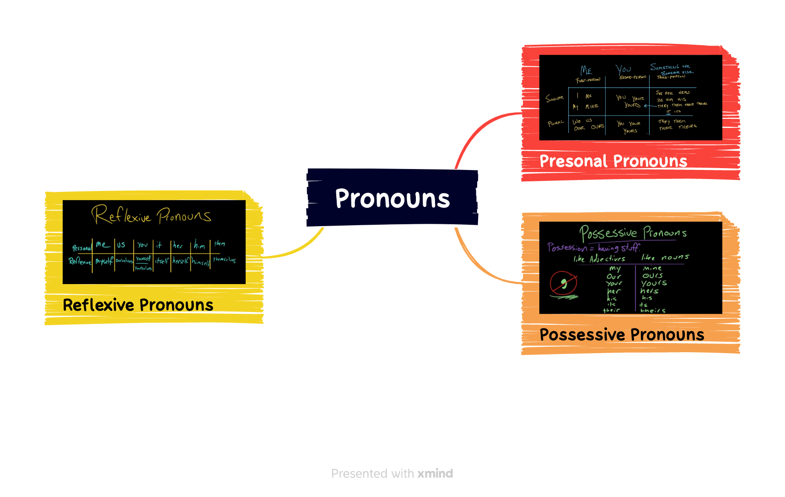

## 语法

## 词汇

|||
|:---:|:---:|
|gear| 英:/ɡɪə(r)/ 美:/ɡɪr/|
|blisters| /'blɪstɚ/|
|waterproof| 英:/ˈwɔːtəpruːf/ 美:/ˈwɔːtərpruːf/|
|sneakers| /'sni:kəz/|
|slushy| /'slʌʃi/|
|gaiter| 英:/'geɪtə/ 美:/'getɚ/|
|neck| 英:/nek/ 美:/nɛk/|
|frigid| 英:/ˈfrɪdʒɪd/ 美:/ˈfrɪdʒɪd/|
|massive| 英:/ˈmæsɪv/ 美:/ˈmæsɪv/|
|hat| 英:/hæt/ 美:/hæt/|
|earmuffs| /'ɪəmʌfs/|
|definitely| 英:/ˈdefɪnətli/ 美:/ˈdefɪnətli/|
|repel| 英:/rɪˈpel/ 美:/rɪˈpel/|
|plug| 英:/plʌɡ/ 美:/plʌɡ/|
|fleece| 英:/fliːs/ 美:/fliːs/|
|underneath| 英:/ˌʌndəˈniːθ/ 美:/ˌʌndərˈniːθ/|
|tights| 英:/taɪts/ 美:/taɪts/|
|miserable| 英:/ˈmɪzrəbl/ 美:/ˈmɪzrəbl/|
|cotton| 英:/ˈkɒtn/ 美:/ˈkɑːtn/|
|blend| 英:/blend/ 美:/blend/|
|wool| 英:/wʊl/ 美:/wʊl/|
|nylon| 英:/ˈnaɪlɒn/ 美:/ˈnaɪlɑːn/|
|polyester| 英:/ˌpɒlɪ'estə/ 美:/ˌpɑlɪ'ɛstɚ/|
|fiber| 英:/ˈfaɪbə/ 美:/ˈfaɪbɚ/|
|synthetic| 英:/sɪn'θetɪk/ 美:/sɪn'θɛtɪk/|
|soaking| 英:/ˈsəʊkɪŋ/ 美:/'sokɪŋ/|
|sweat| 英:/swet/ 美:/swet/|
|moisture| 英:/ˈmɔɪstʃə(r)/ 美:/ˈmɔɪstʃər/|
|fair| 英:/feə(r)/ 美:/fer/|
|gloves| /glʌv/|
|sweating| /'swetiŋ/|
|waist| 英:/weɪst/ 美:/weɪst/|
|tie| 英:/taɪ/ 美:/taɪ/|
|wicking| 英:/'wɪkɪŋ/ 美:/'wɪkɪŋ/|
|sleeved| /sliːvd/|
|peeking out| |
|crisp| 英:/krɪsp/ 美:/krɪsp/|
|overheat| 英:/əʊvə'hiːt/ 美:/ˌovɚ'hit/|
|chill| 英:/tʃɪl/ 美:/tʃɪl/|
|boost| 英:/buːst/ 美:/buːst/|
|mental| 英:/ˈmentl/ 美:/ˈmentl/|
|psychological| 英:/ˌsaɪkəˈlɒdʒɪkl/ 美:/ˌsaɪkəˈlɑːdʒɪkl/|
|barriers| /'bærɪr/|
|motivate| 英:/ˈməʊtɪveɪt/ 美:/ˈmoʊtɪveɪt/|
|badass| 英:/'bædæs/ 美:/ˈbædˌæs/|
|activist| 英:/ˈæktɪvɪst/ 美:/ˈæktɪvɪst/|
|attract| 英:/əˈtrækt/ 美:/əˈtrækt/|
|struggle| 英:/ˈstrʌɡl/ 美:/ˈstrʌɡl/|
|grudging| 英:/ˈgrʌdʒɪŋ/ 美:/'ɡrʌdʒɪŋ/|
|incredibly| 英:/ɪnˈkredəbli/ 美:/ɪnˈkredəbli/|
|comparison| 英:/kəmˈpærɪsn/ 美:/kəmˈpærɪsn/|
|slams| /slæms,/|

## 听力

MARIELLE SEGARRA, HOST:

This is NPR's LIFE KIT. I'm Marielle Segarra. And I'm joined by NPR's Wynne Davis. Hey, Wynne.

WYNNE DAVIS, BYLINE: Hey, Marielle. So I heard you like to run.

SEGARRA: I do.

DAVIS: Same here. But what about when it's cold out?

SEGARRA: You know, if it's less than 40 degrees, I'm probably not going to do it, to be honest.

DAVIS: Yeah. This is something that I struggle with, too. You know, in the winter, it's extremely hard for me to get out of the door and go for a run or a bike ride because it's just so cold out. But not everyone feels that way.

ALISON MARIELLA DESIR: Unpopular opinion - I love running in the cold. It is my absolute favorite time of year. And it's funny because my husband hates the cold and loves running in the summer, so opposites truly do attract.

SEGARRA: That's Alison Mariella Desir. She's a mother, an athlete, an activist and the author of the book "Running While Black."

DESIR: I just love it. I love the cool air on my face. I love the feeling of being really badass because you're one of the only people out there. I love the clothing. I love layers - literally everything.

SEGARRA: It sounds like she's got a whole system.

DAVIS: Yeah, she does. And we'll get into it soon. In this episode of LIFE KIT, we're going to talk to experts about what motivates them to get outside when it's cold. We'll hear safety tips for the winter months, and we'll learn how to build an outfit that will keep you warm so you can get moving.

(SOUNDBITE OF MUSIC)

SEGARRA: OK, Wynne, so I feel like one of the big ***barriers*** that keeps people from running outside in the cold is it's just so cold, right? Like, it can be super uncomfortable, and running already involves some level of pain. So this is really a ***psychological*** barrier. I just wonder where Alison gets the motivation to get out there.

DAVIS: Right. So much of running is mental. Alison says it can depend on if she's training for a race. In that case, you know, she wants to get her ***miles in*** so that when race day comes, she's ready. But she also reminds herself that she feels better, both mentally and physically, after a run. So going outside, even when it's cold, will give her a ***boost*** later.

SEGARRA: OK. That's the mindset part. But then once you get outside, it is still going to be cold. So what do you do to prepare for the physical challenge - right? - the rain, the chill?

DAVIS: Yes. You have to prepare for the elements. And obviously, a big part of that is how you dress. So in the summer, you're trying to stay cool, but in the winter, you want to be warm. You don't want to ***overheat***. Both the Mayo Clinic and the Cleveland ***Clinic*** note that when you get moving, you're going to feel about 20 degrees warmer than it actually is outside. And Alison had some good advice on how to build your ideal outfit so you can get out the door depending on the temperature.

DESIR: Let's say it's, like, 50 degrees outside. So the air is ***crisp***, but the sun is ***peeking*** out. Bear with me now. I would wear shorts, a short-sleeved shirt that is a wicking material and then a long-sleeved shirt over that. And I would start out very cold, but very quickly, that ***long-sleeved*** shirt would come off, and I would ***tie it around my waist***, and I would be ***sweating***, right? Because when you're moving - 50 degrees - it will feel like 70 degrees by the time you get moving.

DAVIS: Alison said she might also add things like ***gloves*** or a ***headband***, and then she'll make adjustments throughout the run based on how she feels.

SEGARRA: OK. I do have to say, for a New Yorker, 50 degrees is actually totally reasonable. Like, some people might even call that ideal running weather.

DAVIS: Yeah. I'd have absolutely no problem running in that weather. And we can talk about when it gets colder. But, you know, this is cold for some people who live in California, Florida, whatever.

SEGARRA: OK. Yeah. That's fair. What is the wicking material she mentioned?

DAVIS: Yeah. The ***moisture-wicking*** material - what it does is it pulls the sweat you're making away from your body without ***soaking*** your clothes. ***Essentially***, it's there to help keep you dry and keep your body temperature where it needs to be. You can go for a ***synthetic*** ***fiber*** here, like ***polyester*** or ***nylon***. Or a ***wool blend works***, too. The big thing is you just don't want anything made of ***cotton*** because that's going to get wet and stay wet, and then you're going to be cold and ***miserable***.

SEGARRA: So what about when it gets colder, like in the 30s?

DAVIS: This is when you're really going to start building more layers or kind of stepping up an existing layer.

DESIR: If it's 30 degrees, I would go out wearing a base layer of ***tights*** - you know, some wicking tights ***underneath*** and then maybe another layer on top of that, or I would wear ***fleece-lined*** tights. On top, I would wear a wicking short-sleeved shirt.

SEGARRA: Again, here's the plug for wicking material. Alison says that that base layer that ***repels*** water sets the foundation for the rest of the outfit.

DESIR: Then I would wear a long-sleeved shirt over that, and I would definitely wear a jacket, a running jacket. I would wear something over my ears. I'm not really a ***hat*** person. I have a ***massive*** head. So I would wear, like, ***earmuffs***, and I would wear gloves.

SEGARRA: OK. And what about when it's really cold outside, like, ***frigid***, don't-want-to-leave-your-house cold? I'm talking, you know, 2 degrees.

DAVIS: At this point, I don't know that I personally would want to go outside. But if you do, this is where you want to start adding some extra protections for your face, like one of those ***neck gaiters*** that you can pull up and down. But you also need to think about keeping your feet warm and dry. That's where a good pair of wool socks comes in. If it's wet or ***slushy*** outside, Alison says that a pair of running ***sneakers*** with Gore-Tex or another ***waterproof*** material can help, too. And this can also really help you avoid those uncomfortable ***blisters***, which are the worst.

SEGARRA: So this sounds like potentially a lot of ***gear***. I wonder, does it get super-expensive?

DAVIS: It can because, you know, a lot of athletic wear isn't cheap. But Alison says that the most important thing here is the sweat-wicking layer, a pair of wool socks and one good pair of shoes. Everything else you can build on as time goes by. You don't need to have every piece of specialized gear to get outside and go for your run.

SEGARRA: All right. So what else should people keep in mind before they head out the door to run in the cold?

DAVIS: Safety is a big one. In the winter, there aren't as many hours of light. So more people might end up running in the dark.
